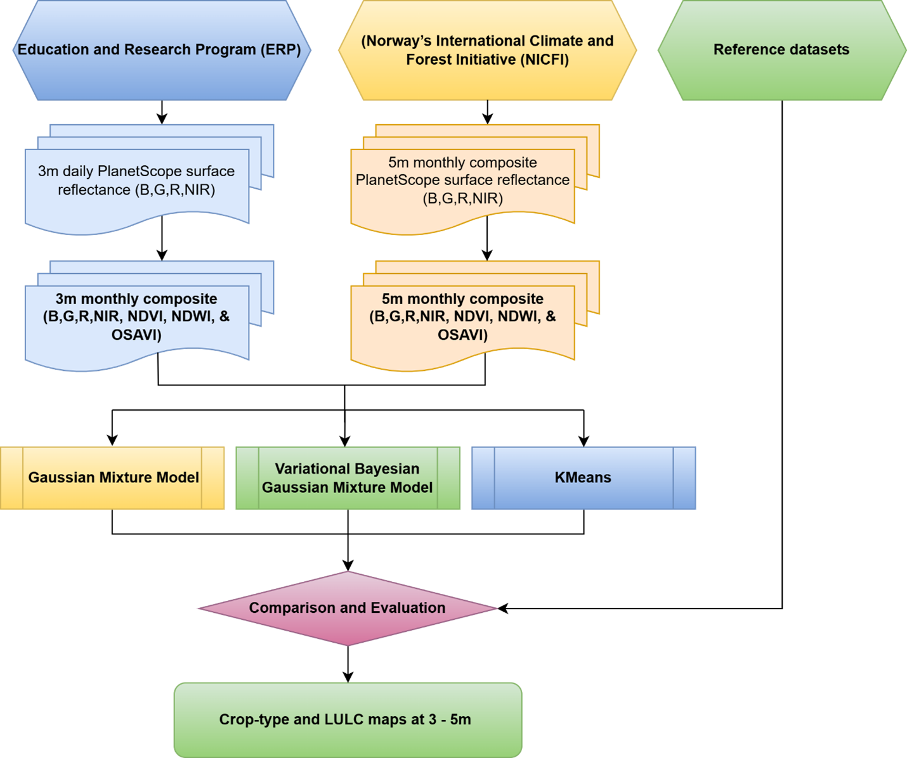
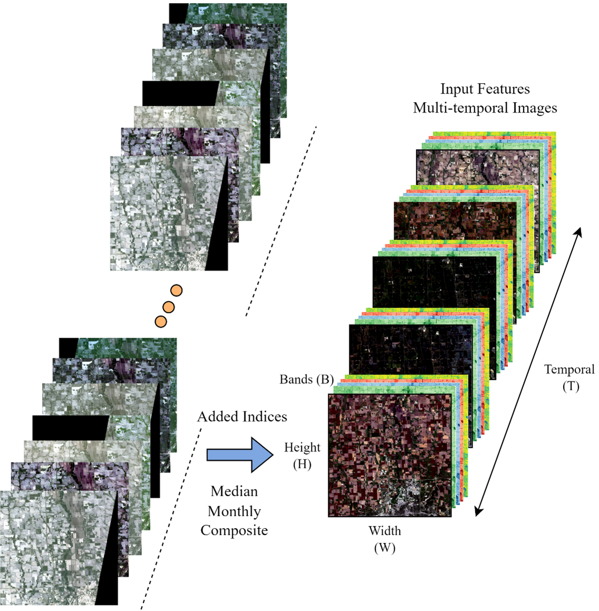

# PlanetScope-TimeSeries
Utilizing Deep Learning Approach to Map land cover and crop type in global study areas with PlanetScope very-high-resolution imagery (< 5 m resolution)

## Proposed Architecture and Workflow
 <br>

## Variational Bayesian Gaussian Mixture Model (VBGMM)
 <br>

## PlanetScope time series data
 <br>

## How to run the code
Create the Python environment 3.8.12 in terminal/command line for Linux OS <br>
```conda env create -f environment.yml``` <br>
```conda activate env``` <br>

To create monthly composite from daily observations (South Dakota, U.S.): <br>
```python src/monthly_composit.py```

To run the VBGMM model, prepare the Dataset in time series format: T x C x H x W <br>
```python src/gaussian_mixture.py``` <br>
```python src/gaussian_mixture_africa.py``` <br>
```python src/gaussian_mixture_hls.py``` <br>

To run the KMeans model, prepare the Dataset in time series format: T x C x H x W <br>
```python src/kmeans_segment.py``` <br>

## Output land cover/crop type maps
 <br>
